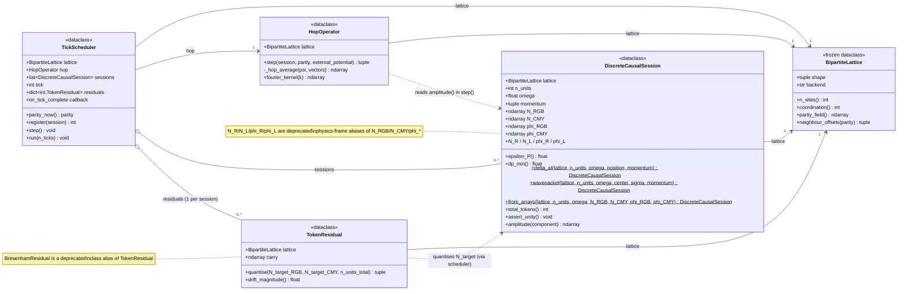
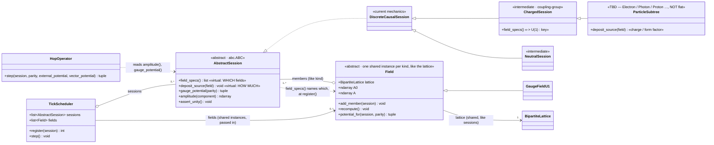

# core3d class design (Mermaid)

**Purpose:** a faithful class diagram of the *current* `dcl_core.core3d`
code (read 2026-06-18), plus a clearly-separated overlay of the proposed
D1 `FieldProvider` seam. Working artifact for the v0.3.0 gauge-field design
(`notes/gauge_field_v030_plan.md`). **Status:** DRAFT.

> Renders inline in VSCode (Markdown preview + a Mermaid extension) and on
> GitHub. Text-based on purpose — edit the source, diff in git.

---

## 1. Current code (faithful)

**Not classes (module-level, shown for context):**
- `lattice.py` constants: `RGB_VECTORS`, `CMY_VECTORS`, `ALL_VECTORS`;
  type aliases `TickParity = "even"|"odd"`, `Component = "RGB"|"CMY"|"R"|"L"`.
- `backends/` — `get_backend(lattice.backend)` dispatches to the `cpu` or
  `gpu` module (functions: `shift`, `cos`, `sin`, `exp`, `sqrt`, `floor`,
  `zeros`, `indices`, `sum_all`, …). Every class reaches arrays through
  this, never directly.

**Per-tick flow** (`TickScheduler.step`): for each session →
`hop.step(session, parity)` → renormalise ψ → `residual.quantise(...)` →
write back `N_*`, `phi_*` → `assert_unity()`. *(Note: the scheduler does
not currently pass `external_potential` to `hop.step` — see D1.)*

---

## 2. PROPOSED overlay — abstract session + per-kind field singletons (NOT yet in code)

> REVISED 2026-06-18: inverted the seam. The engine (`TickScheduler`,
> `HopOperator`) depends on `AbstractSession` + `Field` only and branches
> on no concrete particle type. Type knowledge lives in the session
> hierarchy via two virtuals. Particle taxonomy is **OPEN** (not flat).

**Ownership — "global like the lattice".** Fields are NOT a process/module
global: like `BipartiteLattice`, each is one shared instance the
experiment constructs and **passes by reference** (identity-shared per
simulation → no cross-test state bleed). The scheduler holds them
(`fields: list[Field]`) exactly as it holds its `lattice` ref. Unlike the
frozen lattice, a `Field` is **mutable** (recomputes `A0`/`A` each tick).

**Per-tick flow (scheduler branches on nothing):**
`register(session)` matches `session.field_specs()` to the passed-in
fields and calls `field.add_member(session)`. Then each `step()`:
`field.recompute()` for all fields (start-of-tick read ⇒ Jacobi, = D1b) →
per session `A0, A = session.gauge_potential(parity)` (pulls
`field.potential_for(self)`, self-source excluded = D1c) →
`hop.step(session, parity, A0, A)` → quantise → write back.

**Two virtuals at two depths** (the only structural commitment;
everything else in the taxonomy is open):
- `field_specs()` — *which* field — overridden HIGH (coupling-group, e.g.
  `ChargedSession`).
- `deposit_source(field)` — *how much* — overridden LOW (species).

The static `exp_03` background is then just a degenerate `Field` with a
fixed `A0`/`A` and no members. 71 candidate kinds (`dcl-generator-zoo`) ⇒
prefer a small hierarchy + parameter registry over 71 hand-written
classes. Open sub-decisions + rationale live in
`notes/gauge_field_v030_plan.md` (D1 refinement).
